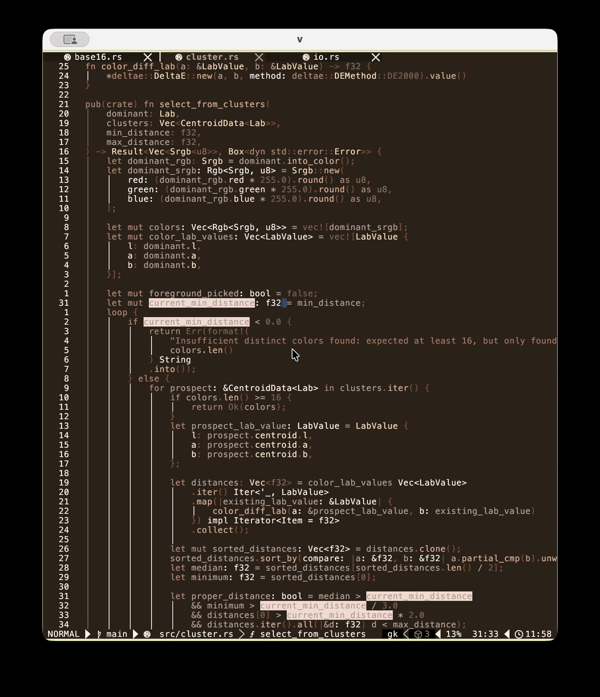

# quicktheme

<p align="center">
  
</p>

> Demonstrates the **quicktheme CLI** paired with [quicktheme.nvim](https://github.com/blackhat-hemsworth/quicktheme.nvim) — generate a Base16 color scheme from any image and apply it live in Neovim.

A Rust CLI for extracting Base16 color schemes from images using K-means clustering.

## Overview

quicktheme analyzes an image and create a sensible base16 colorscheme based on K-means clustering metholodology. The resulting colorscheme will use colors from the source image. It will be based in  the dominant color, but should also have a decent level of contrast with the foreground and tertiary colors.

and extracts 16 perceptually distinct colors using two-stage K-means clustering in Lab color space. Colors are selected with configurable distance constraints (Delta E 2000) and output to a Base16 color scheme in YAML format.

## Installation

```bash
git clone https://github.com/blackhat-hemsworth/quicktheme.git
cd quicktheme
cargo install --path .
```

## Usage

```bash
# Basic usage — outputs Base16 YAML to stdout
quicktheme -f path/to/image.jpg

# With options
quicktheme -f image.jpg -t my_theme -a "Author" -o ./themes -r 42 -m 15.0 -M 80.0
```

### Options

| Flag | Description | Default |
|------|-------------|---------|
| `-f, --source-file` | Source image path (required) | — |
| `-t, --theme-name` | Scheme name | image filename |
| `-o, --output-directory` | Save directory (omit for stdout) | stdout |
| `-a, --author` | Author attribution | "Anonymous" |
| `-r, --seed` | Random seed for reproducibility | 68 |
| `-m, --min-distance` | Minimum perceptual distance between colors | 12.0 |
| `-M, --max-distance` | Maximum perceptual distance cap | 100.0 |
| `--no-grid` | Disable ANSI color grid preview | — |
| `--output-mode` | `swap` (invert bg/fg) or `scramble` (randomize) | — |

## Output Format

Generated YAML files follow the Base16 specification, with a command line inserted for reproducibility:

```yaml
scheme: my_theme
author: Author
command: quicktheme -f image.jpg -a 'Author' -r 42 -m 15 -M 80 -t "my_theme"
base00: baa194
base01: 887e49
...
base0F: 9b8987
```

## License

GPLv3
